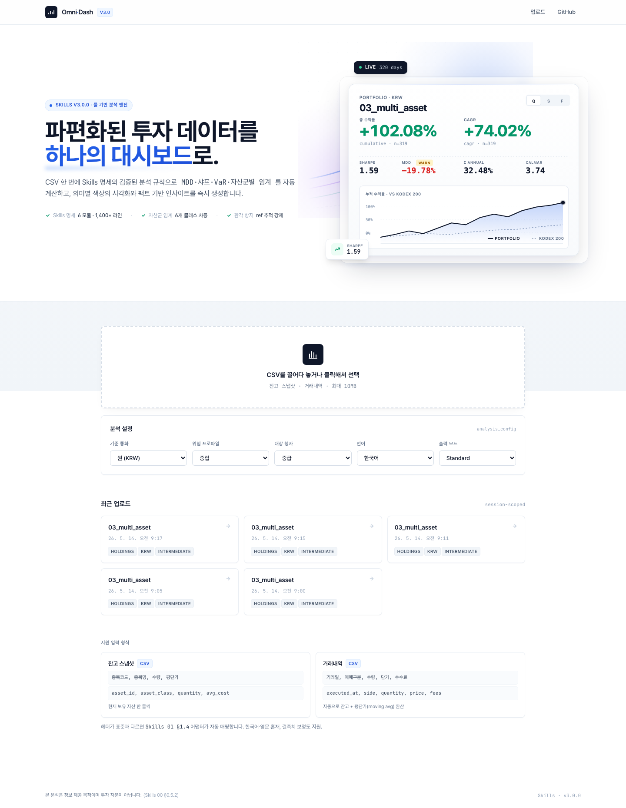

# Omni-Dash

> **CSV 한 번에 검증된 분석 규칙으로 만드는 투자 대시보드.**
> Skills.md 명세를 단일 진실 원천으로 사용하는 풀스택 금융 분석 서비스.

<p align="center">
  
</p>

[](https://spring.io/projects/spring-boot)
[](https://nextjs.org)
[](https://www.postgresql.org)
[](docs/final_skills/INDEX.md)
[](#-license)

---

## 📑 목차

- [핵심 기능](#-핵심-기능)
- [아키텍처](#-아키텍처)
- [Quick Start (5분)](#-quick-start-5분)
- [환경변수](#%EF%B8%8F-환경변수)
- [샘플 데이터로 검증](#-샘플-데이터로-검증)
- [API 레퍼런스](#-api-레퍼런스)
- [프로덕션 배포](#-프로덕션-배포)
- [로컬 개발 (Docker 없이)](#-로컬-개발-docker-없이)
- [Skills 시스템](#-skills-시스템)
- [트러블슈팅](#-트러블슈팅)
- [프로젝트 구조](#-프로젝트-구조)
- [팀 · 라이선스](#-팀)

---

## ✨ 핵심 기능

| | 기능 | 동작 |
|---|---|---|
| 🪄 | **자동 컬럼 매핑** | 한국어·영문 비표준 헤더 → 표준 필드 자동 변환 (Skills 01 §1.4) |
| 📊 | **검증된 메트릭** | MDD · 샤프 · 소르티노 · VaR · CVaR · 칼마 · 알파/베타 (확정 공식) |
| 🎯 | **자산군별 차등 임계** | equity / etf / bond / crypto / commodity / fund 각각 다른 위험 임계 |
| 🌐 | **다중 통화 자동 환산** | KRW · USD · EUR · JPY · CNY · GBP · HKD (고정 환율 테이블) |
| 🔥 | **임계값 핫리로드** | `thresholds.yml` 텍스트 수정 → 버튼 한 번 → 즉시 재계산 |
| 🚦 | **3단 출력 모드** | Quick (단일 KPI) / Standard (요약) / Full (전체 리포트) |
| 🧮 | **거래내역 자동 변환** | buy/sell/dividend 이력 → 잔고 + 평단가(moving average) 자동 산출 |
| 🛡 | **환각 방지 가드레일** | 모든 인사이트에 `[ref: metric=, period=, n=]` 추적성 강제 |

자세한 시연 흐름은 [`DEMO.md`](DEMO.md) 참조.

---

## 🏗 아키텍처

```
┌─────────────────────────────────────────────────────────────────┐
│  Browser (Chrome/Safari)                                        │
│  └─ http://localhost:3000  ─────────► [Next.js SSR + RSC]      │
└─────────────────────────────────────────────────────────────────┘
                                            │
                                    cookie: omnidash_sid
                                            │
┌─────────────────────────────────────────────────────────────────┐
│  docker-compose 네트워크                                         │
│                                                                 │
│  ┌──────────────────┐         ┌──────────────────────────────┐ │
│  │  omnidash-front  │ ◄─SSR─► │  omnidash-backend            │ │
│  │  Next.js 14      │         │  Spring Boot 3.2.5 / JDK 21  │ │
│  │  :3000           │         │  :8080 (호스트 :18080)       │ │
│  └──────────────────┘         │                              │ │
│                                │  • CSV 어댑터 (Skills 01)   │ │
│                                │  • 메트릭 엔진 (Skills 02)   │ │
│                                │  • 차트 매퍼 (Skills 03)     │ │
│                                │  • 룰 NLG (Skills 04)        │ │
│                                │  • 출력 계약 (Skills 05)     │ │
│                                └─────────┬────────────────────┘ │
│                                          │ JDBC                  │
│                                ┌─────────▼────────────────────┐ │
│                                │  omnidash-postgres           │ │
│                                │  PostgreSQL 16 + Flyway      │ │
│                                │  :5432                       │ │
│                                └──────────────────────────────┘ │
└─────────────────────────────────────────────────────────────────┘
```

### 기술 스택

| 영역 | 기술 | 비고 |
|---|---|---|
| **백엔드** | Spring Boot 3.2.5, Java 17+ (도커는 JDK 21) | Records, switch expressions, Lombok |
| **DB** | PostgreSQL 16-alpine + Flyway | `V1__init.sql` 자동 마이그레이션 |
| **CSV** | Apache Commons CSV 1.10 | UTF-8 + 한국어 헤더 |
| **메트릭** | 자체 구현 (`MetricsEngine.java`) | GBM 결정적 시뮬레이션 + tabular FX |
| **프론트** | Next.js 14 (App Router), TypeScript, Tailwind | `output: 'standalone'` |
| **차트** | Recharts 2.12 | Skills 03 매트릭스 매핑 |
| **폰트** | Pretendard Variable + JetBrains Mono | tabular-nums 강제 |
| **세션** | 익명 cookie (`omnidash_sid`, 24h) | JPA + UUID |

---

## 🚀 Quick Start (5분)

### Prerequisites

| 도구 | 최소 버전 | 확인 |
|---|---|---|
| Docker | 20.10+ | `docker --version` |
| Docker Compose | v2.0+ | `docker compose version` |
| 가용 포트 | 3000, 5432, 18080 | `lsof -i :3000` |
| 디스크 여유 | ~2GB | 이미지 + 의존성 캐시 |
| RAM | ~2GB 권장 | JVM 힙 768MB + Next.js + PG |

> Git, curl, make는 선택 (있으면 편함). Java/Node/PostgreSQL 로컬 설치 **불필요**.

### 1. 클론

```bash
git clone https://github.com/Seoul-17/omni-dash.git
cd omni-dash
```

### 2. 환경변수 준비

```bash
cp .env.example .env
# 로컬 데모는 기본값으로 충분. 프로덕션은 §환경변수 참고
```

### 3. 빌드 + 기동

```bash
make up
# 또는: docker compose --env-file .env up -d --build
```

최초 빌드는 **5~8분** 소요 (Gradle/npm 의존성 다운로드). 이후 재기동은 ~10초.

### 4. 동작 확인

```bash
# 백엔드 헬스체크
curl http://localhost:18080/api/ping
# → {"status":"ok","service":"omnidash-backend","skillVersion":"3.0.0"}

# 컨테이너 상태
docker compose ps
# 모두 healthy / Up 상태여야 함
```

### 5. 브라우저 열기

```
http://localhost:3000
```

홈에서 **샘플 데이터 카드 3개 중 하나 클릭** → 즉시 대시보드 진입. CSV 준비 불필요.

### 종료

```bash
make down            # 컨테이너만 정지 (DB 보존)
make clean           # 컨테이너 + 볼륨 삭제 (DB 데이터 손실)
```

---

## ⚙️ 환경변수

`.env`에서 일괄 관리. 모든 값은 `.env.example`에 기본값 + 주석으로 문서화됨.

### 기본 (로컬 데모는 수정 불필요)

| 변수 | 기본값 | 설명 |
|---|---|---|
| `POSTGRES_DB` | `omnidash` | PostgreSQL 데이터베이스명 |
| `POSTGRES_USER` | `omnidash` | DB 사용자명 |
| `POSTGRES_PASSWORD` | `change-me-in-prod` | **프로덕션 필수 변경** |
| `POSTGRES_PORT` | `5432` | 호스트 DB 포트 |
| `BACKEND_PORT` | `18080` | 호스트 백엔드 포트 (8080 충돌 회피) |
| `FRONTEND_PORT` | `3000` | 호스트 프론트엔드 포트 |

### 백엔드

| 변수 | 기본값 | 설명 |
|---|---|---|
| `SPRING_PROFILES_ACTIVE` | `docker` | Spring 프로파일 |
| `JAVA_OPTS` | `-Xms256m -Xmx768m` | JVM 힙. 데모는 충분, 대용량 데이터는 ↑ |
| `SESSION_TTL_SECONDS` | `86400` | 익명 세션 쿠키 만료 (24h) |
| `CORS_ALLOWED_ORIGINS` | `http://localhost:3000` | 콤마 구분. 프로덕션 도메인 추가 |
| `SKILLS_CONFIG_PATH` | (empty) | 외부 `thresholds.yml` 디렉토리. 비우면 jar 내장 사용 |

### 프론트엔드

| 변수 | 기본값 | 설명 |
|---|---|---|
| `NEXT_PUBLIC_API_BASE_URL` | `http://localhost:18080` | **빌드 타임** 주입 (브라우저 호출용) |
| `INTERNAL_API_BASE_URL` | `http://backend:8080` | **런타임** (SSR이 컴포즈 내부 네트워크로 호출) |

> ⚠️ `NEXT_PUBLIC_*`는 빌드 시 정적 번들에 박힙니다. 도메인 변경 시 `docker compose build frontend` 재실행 필요.

---

## 🧪 샘플 데이터로 검증

CSV 없이도 즉시 기능을 확인할 수 있도록 3개 시연 시나리오가 번들됨.

홈페이지 **"또는 샘플로 둘러보기"** 섹션:

| 샘플 | 시연 포인트 | 자동 모드 |
|---|---|---|
| 🎯 **다자산 포트폴리오** | BTC/ETH `crypto` 임계 15% 초과 자동 경고 | Full + intermediate |
| 🪄 **엉망 입력 자동 매핑** | 한국어 비표준 헤더 + 결측치 보정 | Standard + novice |
| 📜 **거래내역 자동 변환** | 매수/매도/배당 → 잔고 + moving_avg 평단가 | Standard + intermediate |

원클릭 → 자동 업로드 → 대시보드 자동 진입. 자세한 시연은 [`DEMO.md`](DEMO.md).

### CLI 검증

```bash
# 1. 샘플 업로드
PID=$(curl -sS -c /tmp/c.txt -b /tmp/c.txt -X POST http://localhost:18080/api/upload \
  -F "file=@docs/final_skills/examples/03_multi_asset.csv" \
  -F "mode=full" | jq -r '.portfolioId')
echo "Portfolio: $PID"

# 2. 대시보드 조회
curl -sS -c /tmp/c.txt -b /tmp/c.txt \
  "http://localhost:18080/api/dashboard/$PID?mode=full" | jq '.kpis[] | {label, value, severity}'
```

---

## 🔌 API 레퍼런스

모든 엔드포인트는 익명 세션 쿠키(`omnidash_sid`)를 사용합니다. `curl`은 `-c -b` 플래그로 쿠키 jar를 유지하세요.

### `POST /api/upload`

CSV 업로드. multipart/form-data.

| 파라미터 | 타입 | 기본값 | 설명 |
|---|---|---|---|
| `file` | File | **필수** | CSV (UTF-8). 잔고 또는 거래내역 |
| `baseCurrency` | string | `KRW` | 기준 통화 (ISO 4217) |
| `riskProfile` | enum | `moderate` | conservative / moderate / aggressive |
| `audience` | enum | `intermediate` | novice / intermediate / expert |
| `locale` | enum | `ko-KR` | ko-KR / en-US |
| `mode` | enum | `standard` | quick / standard / full |

**응답:**
```json
{
  "portfolioId": "550e8400-e29b-41d4-a716-446655440000",
  "name": "03_multi_asset",
  "source": "holdings",
  "rowCount": 7,
  "warnings": []
}
```

### `GET /api/dashboard/{portfolioId}?mode={mode}`

전체 대시보드 JSON. 응답 스키마는 [`Skills 05 §6.1`](docs/final_skills/05_contract_skills.md) `DashboardOutput`을 1:1 미러링.

### `GET /api/portfolios`

현재 세션의 모든 포트폴리오 메타 리스트.

### `POST /api/skills/reload`

`SKILLS_CONFIG_PATH` 디렉토리의 `thresholds.yml` 재로드 + 캐시 무효화. 시연 3에 사용.

### `GET /api/ping`

헬스체크. 인증 불필요.

```bash
curl http://localhost:18080/api/ping
# {"status":"ok","service":"omnidash-backend","skillVersion":"3.0.0"}
```

---

## 🌐 프로덕션 배포

`docker-compose.yml`은 어디든 그대로 이식 가능 (EC2, Fly.io, Render, GCP VM, 자체 서버 ...).

### 단일 호스트 + Caddy (가장 간단)

```bash
# 1. 서버에 클론
git clone https://github.com/Seoul-17/omni-dash.git && cd omni-dash

# 2. 프로덕션용 .env
cp .env.example .env
nano .env  # POSTGRES_PASSWORD, CORS_ALLOWED_ORIGINS, NEXT_PUBLIC_API_BASE_URL 변경

# 3. 기동
docker compose --env-file .env up -d --build
```

**`/etc/caddy/Caddyfile` 예시 (자동 TLS):**

```caddy
omnidash.example.com {
  reverse_proxy localhost:3000
}

api.omnidash.example.com {
  reverse_proxy localhost:18080
}
```

```bash
sudo caddy reload
# https://omnidash.example.com 접속 가능
```

### Nginx 대안

```nginx
server {
  listen 443 ssl http2;
  server_name omnidash.example.com;
  ssl_certificate     /etc/letsencrypt/live/.../fullchain.pem;
  ssl_certificate_key /etc/letsencrypt/live/.../privkey.pem;

  location / {
    proxy_pass http://localhost:3000;
    proxy_set_header Host $host;
    proxy_set_header X-Forwarded-Proto https;
    proxy_set_header X-Forwarded-For $remote_addr;
  }
}

server {
  listen 443 ssl http2;
  server_name api.omnidash.example.com;
  # ... TLS ...
  location / {
    proxy_pass http://localhost:18080;
    proxy_set_header Host $host;
    proxy_set_header X-Forwarded-Proto https;
  }
}
```

### 프로덕션 `.env` 변경 사항

```env
# 반드시 변경
POSTGRES_PASSWORD=<32자 이상 랜덤>
CORS_ALLOWED_ORIGINS=https://omnidash.example.com
NEXT_PUBLIC_API_BASE_URL=https://api.omnidash.example.com
INTERNAL_API_BASE_URL=http://backend:8080   # 컴포즈 네트워크라 그대로

# 운영 환경에 맞게 조정
JAVA_OPTS=-Xms512m -Xmx1500m
SESSION_TTL_SECONDS=604800                  # 7일
```

> **빌드 캐시 주의**: `NEXT_PUBLIC_API_BASE_URL`은 정적 번들에 박히므로 변경 후 반드시 `docker compose build frontend` 재실행.

### 보안 체크리스트

- [ ] `POSTGRES_PASSWORD` 강력한 랜덤 값으로 변경
- [ ] `CORS_ALLOWED_ORIGINS`에 실제 도메인만 (와일드카드 X)
- [ ] PostgreSQL 5432 포트 외부 노출 차단 (방화벽 또는 `docker-compose.yml`의 `ports:` 제거)
- [ ] 리버스 프록시에서 TLS 적용 (Caddy 자동 또는 Let's Encrypt)
- [ ] PostgreSQL 데이터 디렉토리 정기 백업 (`docker volume inspect omnidash_postgres_data`)
- [ ] `SKILLS_CONFIG_PATH`를 별도 볼륨 마운트하여 운영자가 SSH로 임계값 수정 가능하게

### 헬스체크 자동화

```bash
# crontab 예시 — 5분마다 백엔드 healthcheck
*/5 * * * * curl -fsS https://api.omnidash.example.com/api/ping > /dev/null || systemctl restart docker-compose@omnidash
```

---

## 💻 로컬 개발 (Docker 없이)

### 백엔드

```bash
# Java 17+ 필요 (asdf, sdkman 등으로 설치)
# PostgreSQL 16 로컬 또는 docker compose up -d postgres

cd backend
./gradlew bootRun
# 또는 IDE에서 OmnidashApplication 실행
```

`application-local.yml`이 자동 활성화됩니다. DB는 `jdbc:postgresql://localhost:5432/omnidash` 가정.

### 프론트엔드

```bash
cd frontend
npm install
NEXT_PUBLIC_API_BASE_URL=http://localhost:18080 npm run dev
# http://localhost:3000
```

### DB만 도커로

```bash
docker compose --env-file .env up -d postgres
# 백엔드 + 프론트엔드는 로컬, DB만 컨테이너
```

### 테스트 실행

```bash
cd backend && ./gradlew test
# ColumnMapperTest 등 단위 테스트
```

---

## 📐 Skills 시스템

본 프로젝트의 **단일 진실 원천**은 `docs/final_skills/`의 6개 모듈입니다.

| 모듈 | 책임 |
|---|---|
| [`00_core_skills.md`](docs/final_skills/00_core_skills.md) | 진입점, 파이프라인, 출력 모드, audience, 전역 가드레일 |
| [`01_data_skills.md`](docs/final_skills/01_data_skills.md) | 정규화, 입력 어댑터, 거래내역→잔고 변환 |
| [`02_metrics_skills.md`](docs/final_skills/02_metrics_skills.md) | 시맨틱 레이어, 자산군별 임계, audience 노출 |
| [`03_visualization_skills.md`](docs/final_skills/03_visualization_skills.md) | 차트 매트릭스, 색상 거버넌스 |
| [`04_report_skills.md`](docs/final_skills/04_report_skills.md) | BUILD 5단, NLG 트리거, 용어 사전 |
| [`05_contract_skills.md`](docs/final_skills/05_contract_skills.md) | 출력 계약, 캐시, 핫리로드 |

코드에 흩어진 임계·공식이 **모두 명세에서 도출**됩니다. 임계값을 바꾸려면:

```bash
# 1. 외부 디렉토리로 thresholds.yml을 마운트
mkdir -p ./skills-override
cp backend/src/main/resources/skills/thresholds.yml ./skills-override/
echo "SKILLS_CONFIG_PATH=/skills" >> .env

# docker-compose.yml 의 backend 서비스에 다음 한 줄 추가:
#   volumes:
#     - ./skills-override:/skills:ro

# 2. 재기동
make down && make up

# 3. 운영 중 임계값 수정 후 — 재빌드 없이!
nano skills-override/thresholds.yml
curl -X POST http://localhost:18080/api/skills/reload
# 또는 대시보드 우상단 "🔁 Skills 재로드" 버튼
```

대시보드의 `cache_key`가 변경되며 모든 인사이트·임계 색상이 즉시 갱신됩니다.

---

## 🩹 트러블슈팅

### 포트 충돌

```
Error: Ports are not available: exposing port TCP 0.0.0.0:18080
```

→ 다른 프로세스가 18080 점유. `.env`에서 `BACKEND_PORT=28080` 등 변경. `NEXT_PUBLIC_API_BASE_URL`도 같이 변경 + `docker compose build frontend`.

### 백엔드가 healthy로 못 가는 경우

```bash
docker logs omnidash-backend --tail 80
```

흔한 원인:
- **Flyway migration 실패** → DB 볼륨 삭제 후 재시도: `make clean && make up`
- **JVM OOM** → `JAVA_OPTS=-Xms512m -Xmx1500m`로 ↑
- **DB 연결 실패** → `docker compose ps` 에서 postgres가 healthy인지 확인

### "server-side exception" on dashboard

세션 쿠키가 없는 브라우저에서 직접 `/dashboard/{uuid}` 접근 시 발생.
→ 홈으로 가서 샘플 카드 클릭 또는 CSV 업로드.

### 프론트엔드가 백엔드를 못 찾음 (CORS / 404)

`.env`의 `NEXT_PUBLIC_API_BASE_URL`이 정적 번들에 박혀 있어서 변경 시 재빌드 필요:

```bash
docker compose --env-file .env up -d --build frontend
```

### Skills 재로드해도 변화 없음

`SKILLS_CONFIG_PATH`가 비어 있으면 jar 내장 YAML을 사용 (재로드해도 같은 파일). 외부 디렉토리 마운트 필요. `docker compose exec backend ls /skills` 로 확인.

### 캐시가 비워지지 않음

```bash
docker compose exec postgres psql -U omnidash -d omnidash -c "DELETE FROM dashboard_cache;"
# 또는: make db-shell → DELETE FROM dashboard_cache;
```

---

## 📂 프로젝트 구조

```
.
├── backend/                              # Spring Boot 3.2.5 (JDK 17+)
│   ├── build.gradle.kts                  # Gradle Kotlin DSL
│   ├── Dockerfile                        # gradle:8.7-jdk21 + temurin:21-jre
│   └── src/main/
│       ├── java/com/omnidash/
│       │   ├── OmnidashApplication.java
│       │   ├── config/                   # CORS, ConfigurationProperties
│       │   ├── controller/               # 4개 REST 컨트롤러
│       │   ├── domain/{entity,repository}/  # JPA + repositories
│       │   ├── dto/                      # DashboardOutput 등 record DTO
│       │   ├── exception/                # ApiException + GlobalHandler
│       │   ├── service/
│       │   │   ├── csv/                  # ColumnMapper, CsvParserService
│       │   │   ├── metrics/              # MetricsEngine, FxRates, PriceSimulator
│       │   │   ├── viz/                  # ChartBuilder (차트 매트릭스)
│       │   │   ├── insight/              # InsightEngine (룰 NLG)
│       │   │   ├── skills/               # SkillsConfig (YAML 핫리로드)
│       │   │   ├── DashboardOrchestrator # 파이프라인 [0]~[5] 실행
│       │   │   ├── PortfolioService
│       │   │   └── SessionService        # 익명 쿠키 세션
│       │   └── ...
│       └── resources/
│           ├── application.yml + application-{local,docker}.yml
│           ├── db/migration/V1__init.sql
│           └── skills/thresholds.yml     # 시연 3 핫리로드 대상
│
├── frontend/                             # Next.js 14 + TypeScript + Tailwind
│   ├── Dockerfile                        # node:20-alpine multi-stage
│   ├── tailwind.config.ts                # Pretendard + JetBrains Mono
│   ├── public/
│   │   ├── samples/*.csv                 # 샘플 데이터 5종
│   │   ├── hero-dashboard-glimpse.svg    # 히어로 제품 미리보기
│   │   └── hero-accent-curves.svg        # 히어로 추상 라인
│   └── src/
│       ├── app/
│       │   ├── layout.tsx                # 폰트 + 헤더/푸터
│       │   ├── page.tsx                  # 홈 (Hero + Upload + Samples)
│       │   ├── not-found.tsx
│       │   └── dashboard/[sessionId]/page.tsx   # 대시보드 SSR
│       ├── components/
│       │   ├── UploadDropzone.tsx
│       │   ├── SampleShowcase.tsx
│       │   ├── PortfolioList.tsx
│       │   ├── KpiCard.tsx (hero/default 변형)
│       │   ├── InsightCard.tsx
│       │   ├── ReportPanel.tsx (BUILD 5단)
│       │   ├── SkillsReloadButton.tsx
│       │   ├── RawMetricsDisclosure.tsx
│       │   └── charts/ChartRenderer.tsx  # Recharts 통합 렌더러
│       ├── lib/{api,format}.ts
│       ├── types/dashboard.ts            # Skills 05 §6.1 1:1 미러
│       └── styles/globals.css            # 컴포넌트 클래스 + base
│
├── docs/
│   ├── final_skills/                     # 제출용 Skills 명세 (v3.0.0)
│   │   ├── 00_core_skills.md → 05_contract_skills.md
│   │   ├── INDEX.md, CHANGELOG.md
│   │   └── examples/                     # 골든 케이스 5종
│   ├── plan/기획서.{md,pdf}
│   ├── notice/개요.md                    # 해커톤 규정
│   └── img/{hero,dashboard}.png          # README용
│
├── docker-compose.yml                    # postgres + backend + frontend
├── .env.example                          # 환경변수 템플릿
├── Makefile                              # up/down/logs/db-shell 등
├── DEMO.md                               # 시연 1·2·3 단계별 가이드
└── README.md                             # (이 문서)
```

---

## 👥 팀

| 이름 | GitHub | 역할 |
|---|---|---|
| **김해찬** | [@k-haechan](https://github.com/k-haechan) | Backend / AI Architecture |
| **천창현** | [@rearleg](https://github.com/rearleg) | Frontend / UI Architecture |
| **이정원** | [@JeongWon4034](https://github.com/JeongWon4034) | Data Engineering / Analysis |

---

## 🔗 링크

- 해커톤: [Daker.ai — Investment Data Skills Dashboard](https://daker.ai/public/hackathons/hackathon-investment-data-skills-dashboard)
- Skills 명세 v3.0.0: [`docs/final_skills/INDEX.md`](docs/final_skills/INDEX.md)
- 기획서: [`docs/plan/기획서.md`](docs/plan/기획서.md)
- 시연 가이드: [`DEMO.md`](DEMO.md)

---

## ⚖️ Disclaimer

본 서비스는 **정보 제공 목적**이며 투자 자문이 아닙니다 (Skills 00 §0.5.2). 모든 투자의 책임은 사용자 본인에게 있습니다.

가격 시뮬레이션은 외부 API 없이 결정적 GBM(Geometric Brownian Motion)으로 합성됩니다 — 해커톤 규정 "심사자가 별도 키 없이 확인 가능" 충족용. 실서비스에서는 실시간 가격 API 연동을 권장합니다.

## 📄 License

Apache License 2.0. Skills 명세도 동일 라이선스 (`docs/final_skills/*.md` frontmatter 참조).

---

**© 2026 Omni-Dash Team.**
